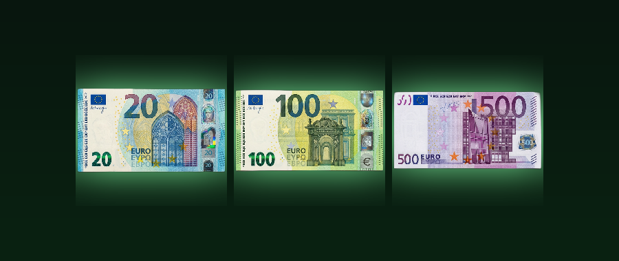

# Euro Bills

**Physical euro-style bills as money: serial numbers, an anti-dupe registry and bank NPCs.**

---

> **ALPHA** - this is an early version. It works for the author, but expect rough edges and changes. Bug reports are welcome.

Money you can hold: bills in several denominations, each with its own **serial number**. A registry remembers every serial so a duplicated bill is detected and removed. Bank NPCs let players withdraw cash from, deposit cash to and pay from a scoreboard balance.

## What it does

- Bills from 5 to 500 (custom items) with serial numbers stored in the item lore
- **Anti-dupe serial registry** (capped at 2000 entries) - copies are found and deleted
- **Bank NPC menu**: withdraw, deposit, pay other players (5k pay limit per transaction)
- Scoreboard-based economy - the objective name is configurable by an operator in the Bank Admin menu
- Command-block friendly: `/scriptevent geld:give <amount>` and `geld:take <amount>`

## Download

Download **`Euro-Bills-v1.1.1-alpha.mcaddon`** from the [releases page](../../releases) (or straight from this repository) and open it - Minecraft imports the packs.

1. Create or edit a world and open **Add-Ons**.
2. Activate the **Behavior Pack** and the **Resource Pack** of this add-on.
3. Requires Minecraft Bedrock **1.21.110 or newer**.

If items are missing in your world, check the world's *Experiments* page and enable *Beta APIs* and *Holiday Creator Features* as a fallback.

New to this? Follow **[SETUP-HELP.md](SETUP-HELP.md)** - it walks you through installing and starting it.

## Dev Book

Every pack of mine carries a small easter egg: craft the **Dev Book** with **9 logs** (any wood type, 3x3 in a crafting table) and right-click it. It opens like a book: page 1 the credits, page 2 what this mod is, page 3 the GitHub links (Minecraft cannot open links, so they are shown as text). It also sits in the creative inventory under *Equipment*.

## Notes

- Game currency only - not real money and not legal tender. The bills imitate the look of euro banknotes for use inside the game.
- Not an official Minecraft product. Not approved by or associated with Mojang or Microsoft.

---

Made by **dev:#2444** - [github.com/hash2444](https://github.com/hash2444) - [euro-bills](https://github.com/hash2444/euro-bills)
